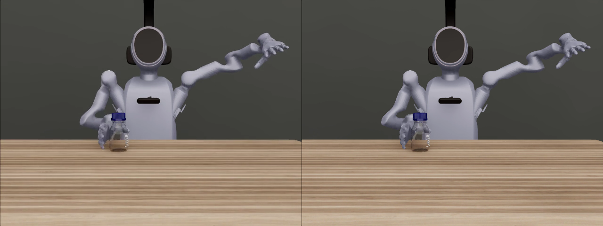
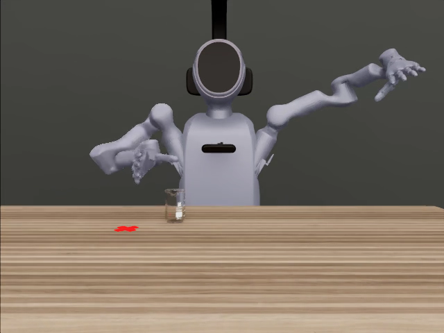
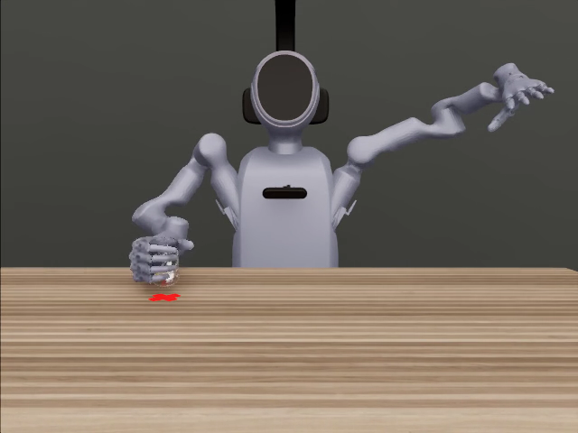
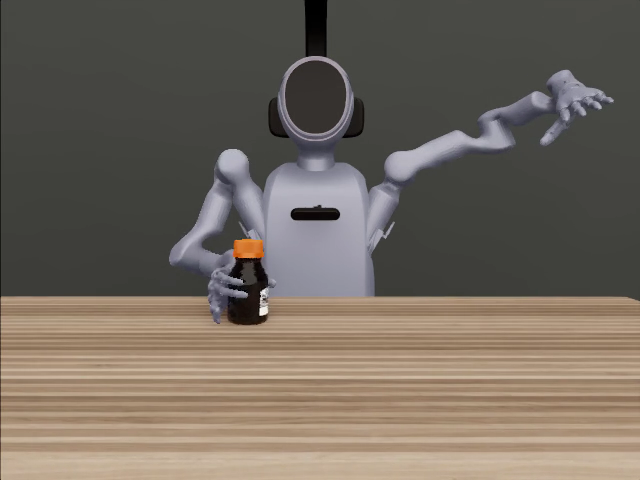

# a100-issacsim — 在没有 RT core 的 A100 上跑 Isaac Sim 渲染评测：要求、实测速度、画质与缺点

> 结论先行（2026-09-08/12，SafeLab/PsiBot 评测线实测；09-12 增补 L0–L2 微基准与 MPS 根因）
>
> 1. **能跑，但官方不支持。** NVIDIA Isaac Sim 5.1.0 的系统要求页明确写着 *"GPUs without RT Cores (A100, H100) are not supported."* 我们在 volc 的 A100-SXM4-80G 上以 headless 方式跑 Isaac Sim 5.1 的 RTX 渲染，从 2026-08-31 起累计 185 场正式评测（每场 50 集、三相机 RGB、录像），功能完整、分数与 RTX 5090 一致。
> 2. **A100 缺的不是硬件，是驱动的图形用户态库。** 同型号 A100 的 30109 之所以跑不起来，是因为驱动按"纯计算"安装：没有 NVIDIA 的 Vulkan ICD、没有 `libnvidia-glcore/eglcore/rtcore/glvkspirv` 等库。装齐与内核模块**同版本**的图形用户态库即可（见 §3、§5）。
> 3. **速度要分层说（§6.0）。** L0 **纯渲染**（三相机 640×480 一帧）：A100 ≈ 47 ms vs 5090 ≈ 40 ms，**只慢 ~1.2 倍**；L1 **纯物理**（PhysX 一步 + Kit 每步固定开销）：48 vs 21 ms，慢 2.3 倍；L2 **仿真控制步**（4 物理步 + 1 渲染）：241 vs 134 ms，慢 1.8 倍；L3 **端到端每集**（含策略推理、录像、重置）：单路中位 100 s vs 46–57 s，慢约 2 倍；单卡吞吐约为 5090 的 35–50%，且 A100 开多路不增吞吐（一路已饱和）。结论：**A100 在这套评测里慢 2 倍，主要来自每步固定开销与物理，而不是缺 RT core 的渲染本身**（微基准均在共用卡上测得，空机数字待补）。
> 4. **画质：肉眼不可分。** 同一 ckpt、同一集（同随机种子 → 同初始布局）、两台机各自渲染：15 组对比前 10 帧 SSIM 0.984–0.994（均值 0.990）、PSNR 35–47 dB（均值 40.7 dB）；全片 SSIM 均值 0.992。差异主要来自视频编码码率与策略动作的微小分歧，不是渲染。唯一缺失的渲染特性是 DLSS / DLSS-RR（A100 硬件不支持，Kit 日志有明确告警）。
> 5. **L4 任务级墙钟（§6.3，同一工作负载、单路、逐项计时）：** 采集或评测 10 集（含 Kit 启动）5090 ≈ 8.5–9 min，A100 干净估计 ≈ 20 min、在被 25 个进程共用时实测 81 min；RL 10 epoch（Cartpole/Franka 4096 envs，无渲染）5090 训练本体 ≈ 10 s、含启动 ≈ 2.5 min；带 tiled 相机 128 envs 训练本体 ≈ 40 s；PsiBot grasp 残差 RL 64 envs 训练本体 ≈ 30 s。A100 的 RL 数字等 volc 空机窗口补测（无渲染负载预期差距 <1.5 倍）。
> 6. **缺点：** 无官方支持、端到端单路慢 2 倍、并发不增吞吐、长回合任务（12 s pick_place）每集 ~17 min、无 DLSS、启动多 40–60 s；**同机任何项目开启 CUDA MPS 后 Isaac 进程全部起不来（需 `CUDA_MPS_PIPE_DIRECTORY` 绕过，§8-7）**。适合做"吞吐型"补种子评测，紧急判决仍放 RTX 5090。

仓库内容：`README.md`（本文）、`results/`（速度与画质数据表）、`media/side_by_side/`（15 个左右并排对比视频，左 = volc A100，右 = bjxy RTX 5090）、`media/frames/`（截帧）、`raw/`（两台机的环境探测原始输出）、`scripts/`（计时/对比脚本，可复现）。

---

## 1. 官方立场与我们的实测

| | 官方（Isaac Sim 5.1.0 Requirements） | 我们的实测（volc-a100） |
|---|---|---|
| GPU | 最低 RTX 4080；"GPUs without RT Cores (A100, H100) are not supported" | 2× A100-SXM4-80GB（GA100，compute capability 8.0，无 RT core） |
| 驱动 | Linux 580.65.06 | 535.129.03（CUDA 12.2），完整图形用户态库 |
| OS | Ubuntu 22.04/24.04 | Ubuntu 22.04.5，内核 5.4.250（veLinux），glibc 2.35 |
| 显示 | — | 无 X server；headless，Graphics API = Vulkan |
| Isaac Sim | 5.1 | pip `isaacsim 5.1.0.0`（conda env `chembench_isaacsim51`，Python 3.11）+ Isaac Lab + psilab/chembench |
| 渲染 | RTX 实时渲染 | 同一 RTX 渲染器；光线求交在 CUDA core 上执行；DLSS 不可用 |
| 结果 | — | 185 场 × 50 集正式评测；与 5090 交叉验证的 8 个 ckpt 中 6 个分数完全一致 |

官方"不支持"的含义是：不做测试与保证、不提供支持；并不是驱动层面拒绝运行。Kit 启动日志（`raw/volc_env_probe.txt`）里可见 A100 被枚举为 Vulkan 设备并被渲染器接受，仅 DLSS 初始化失败：

```
| Driver Version: 535.129.03    | Graphics API: Vulkan
| 0   | NVIDIA A100-SXM4-80GB            | Yes: 0 |     | 81920   MB | 10de      | 0          |
[Warning] [rtx.postprocessing.plugin] NGX cannot find DLSS-RR feature or it is not supported for the current hardware
[Error]   [rtx.postprocessing.plugin] createDLSSContext error: unable to initialize context. Optional DLSS feature is disabled.
```

---

## 2. 为什么 A100 能渲染（原理）

- Omniverse/Isaac Sim 的 RTX 渲染器基于 **Vulkan**，光线追踪走 NVIDIA 的 RT 扩展；在有 RT core 的 GPU（Turing 之后的 GeForce/RTX PRO）上求交由 RT core 硬件执行，在没有 RT core 的 GA100/GH100 上由驱动退回到 **CUDA core 的软件 BVH 遍历**。功能等价、速度更慢。
- 因此 A100 渲染所需的是：**支持 Vulkan 1.3 的完整 NVIDIA 驱动用户态栈** + 渲染器本身。A100 的 Vulkan 支持是驱动自带的（volc 上 ICD 报 api_version 1.3.242）。
- 硬件上真正缺的只有两项：RT core（→ 慢）与 DLSS 所需的特性（→ 无 DLSS/DLSS-RR 降噪、上采样）。

---

## 3. 让 A100 支持 Isaac Sim 渲染需要什么（逐项要求）

### 3.1 硬件
| 项 | 要求 | 说明 |
|---|---|---|
| GPU | A100 40G/80G（SXM 或 PCIe），或 H100 | 需驱动提供 Vulkan 1.3；compute capability ≥ 8.0 |
| 显存 | 每个 Isaac 实例 9–16 GB（三相机 480×640 + PhysX GPU + 策略推理） | 80G 卡可放 3–5 个实例，但吞吐在 1 路时已饱和（§6） |
| CPU/内存 | 与官方一致：≥8 核、≥32 GB | PhysX 部分算力、视频编码（libx264）都在 CPU；CPU 被超卖会显著拖慢（30109 负载 90–170/128 核） |
| 网络 | 首次需拉 Isaac 资产/shader；之后可离线 | 我们用 `HF_HUB_OFFLINE=1`、本地资产 |

### 3.2 驱动（关键）
1. **必须是完整版驱动用户态**，不能是"纯计算/headless"安装：
   - `.run` 安装器**不要**加 `--no-opengl-files`；
   - Ubuntu 包：装 `nvidia-driver-XXX`（普通版），或在 `nvidia-headless-XXX` 之上补 `libnvidia-gl-XXX`、`libnvidia-extra-XXX`、`libnvidia-common-XXX`；
   - 容器：宿主机驱动完整 + `NVIDIA_DRIVER_CAPABILITIES=all`（或 `graphics,compute,utility,display`）。
2. **用户态库版本必须与内核模块版本完全一致**（例如内核模块 580.65.06 就只能配 580.65.06 的库；开源内核模块 `nvidia-open` 也一样）。
3. **必须使用为该系统 glibc 构建的库**。从别的机器/发行版拷来的库不可用：30109 上用 `LD_LIBRARY_PATH` 注入一套 580.65.06 库时，`libnvidia-glcore` 因 `undefined symbol: __malloc_hook`（glibc ≥ 2.34 移除）无法加载，Vulkan 报 `ERROR_INCOMPATIBLE_DRIVER`（`raw/30109_env_probe.txt`）。
4. 版本：≥ 535 实测可用（volc 535.129.03）；Isaac Sim 5.1 官方推荐 580.65.06。
5. 内核模块：`nvidia`、`nvidia_uvm`、`nvidia_modeset`（提供 `/dev/nvidia-modeset`，30109 已有）；`nvidia_drm`/`/dev/dri` **不需要**（volc 有、30109 无，均可）。

需要存在的文件（以 volc 535.129.03 为例，位于 `/usr/lib/x86_64-linux-gnu/`）：
```
libGLX_nvidia.so.0            # Vulkan ICD 实际入口（ICD json 指向它）
libEGL_nvidia.so.0            # EGL（headless 相机/离屏）
libnvidia-glcore.so.535.*     libnvidia-eglcore.so.535.*   libnvidia-glsi.so.535.*
libnvidia-glvkspirv.so.535.*  libnvidia-rtcore.so.535.*    libnvidia-tls.so.535.*
libnvidia-allocator.so.535.*  libnvidia-vulkan-producer.so  libnvidia-ngx.so.535.*（DLSS，A100 上加载但不可用）
libcuda.so.1  libnvidia-ml.so.1  libnvidia-ptxjitcompiler.so.1  libnvidia-nvvm.so.4   # 计算部分（纯计算安装也有）
```
以及注册文件：
```
/etc/vulkan/icd.d/nvidia_icd.json          {"ICD":{"library_path":"libGLX_nvidia.so.0","api_version":"1.3.242"}}
/usr/share/glvnd/egl_vendor.d/10_nvidia.json  {"ICD":{"library_path":"libEGL_nvidia.so.0"}}
```
外加 Vulkan loader：`libvulkan1`（≥1.3）与 `vulkan-tools`（用于 `vulkaninfo` 验证）。

### 3.3 软件
- Isaac Sim 5.1.0（pip `isaacsim==5.1.0.0` 全套 + Isaac Lab）；Python 3.11；PyTorch 2.x CUDA 12。
- 我们的评测栈：psilab/chembench（`isaaclab.python.headless.rendering.isaac51.kit` 体验文件），运行参数 `--headless --enable_cameras`。
- 首次启动会编译 RTX shader（数分钟），之后由 Kit 缓存复用；每场评测 Kit 启动到第一集约 100–170 s。

### 3.4 验证清单（装好后逐条检查）
```bash
nvidia-smi --query-gpu=name,driver_version --format=csv        # 版本 = 内核模块版本
cat /proc/driver/nvidia/version                                  # 内核模块版本
ls /etc/vulkan/icd.d/ /usr/share/vulkan/icd.d/                   # 必须有 nvidia_icd.json
ldconfig -p | grep -E "libnvidia-(glcore|rtcore|glvkspirv|vulkan-producer)|libGLX_nvidia"
vulkaninfo --summary | grep -E "deviceName|driverVersion|apiVersion"   # 期望 deviceName = NVIDIA A100...
# Isaac 冒烟：跑 1 集，日志中应出现 "Graphics API: Vulkan" 与 A100 行；DLSS 告警是预期的、可忽略
```

---

## 4. 安装步骤（三种路径，任选其一）

**A. `.run` 安装器（推荐，可只装用户态）**
```bash
# 与 /proc/driver/nvidia/version 同版本的安装包，例如 580.65.06
sudo sh NVIDIA-Linux-x86_64-580.65.06.run --no-kernel-module --no-x-check --dkms=no
# 不要加 --no-opengl-files；--no-kernel-module 只更新用户态库，不碰已加载的内核模块
sudo apt install -y libvulkan1 vulkan-tools
vulkaninfo --summary | grep -E "deviceName|driverVersion"
```

**B. Ubuntu/Debian 包**
```bash
# 假设已装 nvidia-headless-580 / nvidia-driver-580-open（内核模块 580.65.06）
sudo apt install -y libnvidia-gl-580=580.65.06-0ubuntu1 libnvidia-extra-580=580.65.06-0ubuntu1 libnvidia-common-580=580.65.06-0ubuntu1 libvulkan1 vulkan-tools
# 版本号必须与已装内核模块一致；apt-cache policy libnvidia-gl-580 查可用版本
```

**C. 容器**
```bash
docker run --gpus all -e NVIDIA_DRIVER_CAPABILITIES=all ...   # 宿主机驱动本身必须是完整版
# 镜像内需要 libvulkan1、Vulkan ICD 由 nvidia-container-toolkit 注入（要求宿主机有 libGLX_nvidia / libEGL_nvidia）
```

然后部署 Isaac Sim 5.1 + Isaac Lab + 评测代码（我们直接复制 volc 的 conda 环境 `chembench_isaacsim51` 与 chembench 代码树到本地 NVMe），用 `--headless --enable_cameras` 跑一集冒烟。

---

## 5. 案例：30109（同型号 A100，目前跑不了）的差距与修法

| 项 | volc（可用） | 30109（不可用） |
|---|---|---|
| GPU / 驱动 | A100-80G / 535.129.03 | A100-80G / 580.65.06（开源内核模块） |
| NVIDIA Vulkan ICD | `/etc/vulkan/icd.d/nvidia_icd.json` | **无**（仅 Mesa 的 intel/radeon/lvp/virtio ICD） |
| 图形用户态库 | glcore/eglcore/glsi/glvkspirv/rtcore/tls/vulkan-producer 齐全 | **全无**（只有 CUDA 计算库） |
| EGL vendor | `10_nvidia.json` | 无 |
| `/dev/nvidia-modeset` | 有 | 有（内核侧已具备） |
| `/dev/dri` | 有 | 无（不影响） |
| Vulkan loader | 有 | 有（libvulkan1 1.3.204、vulkan-tools 已装） |
| 权限 | root | uid 1000，**有 sudo** |
| Isaac 环境 | 已部署 | 未部署 |

已尝试且失败的捷径：把别处提取的 580.65.06 用户态库放到 `/home/dataset-local/yf_recovery/nvgfx65/` 并用 `VK_ICD_FILENAMES`/`LD_LIBRARY_PATH` 注入 → `libnvidia-glcore.so.580.65.06: undefined symbol: __malloc_hook` → `vkCreateInstance` 失败（`ERROR_INCOMPATIBLE_DRIVER`）。原因是这套库不是为 30109 的 glibc 构建的。

可行修法（需 sudo，约 1–2 小时；未执行，等 owner/管理员批准）：
1. `sudo sh NVIDIA-Linux-x86_64-580.65.06.run --no-kernel-module --no-x-check` 装完整用户态（或 apt 装 `libnvidia-gl-580=580.65.06-*`）；
2. `vulkaninfo --summary` 看到 A100；
3. 从 volc 复制 `chembench_isaacsim51` 环境与 chembench 代码到 `/home/dataset-local/`，配置资产路径；跑 1 集冒烟；
4. 注意：30109 是共享节点，CPU 长期超卖（负载 90–170 / 128 核），Isaac 单场评测会比 volc 更慢；驱动库安装影响全机用户（只增加图形库，不改内核模块与 CUDA）。

---

## 6. 速度：先说清楚"哪种速度"

前几版把"每集 100 s vs 46 s"直接叫"速度"，容易和"渲染速度"混为一谈。这一节先定义，再按层级给数字；**每张表的表头都标明它属于哪一层**。

### 6.0 定义：五个层级

| 层级 | 名称 | 定义（一次计什么） | 单位 | 数据来源 |
|---|---|---|---|---|
| **L0** | **纯渲染** render-only | RTX 渲染器把三路 640×480 RGB 相机各出一帧并取回 GPU 张量的时间；**不步进物理、不跑策略、不编码视频** | ms / 帧（三相机一组算一帧） | `scripts/bench_render.py`（微基准） |
| **L1** | **纯物理** physics-only | PhysX GPU 一步 `dt = 1/120`（TGS 求解器、与评测同参数），**不渲染** | ms / 物理步 | 同上 |
| **L2** | **仿真控制步** sim control step | 评测里一个 30 Hz 控制步的**仿真部分**：4 个物理子步 + 1 次三相机渲染 + 取回图像；**无策略推理、无录像、无回合重置** | ms / 控制步（6 s 一集 = 180 步） | 同上 |
| **L3** | **端到端每集** end-to-end per episode | 正式评测流程里一集的墙钟：L2 × 180 + 策略推理（ACT/DP）+ 成功判定 + 视频编码 + 回合重置 | s / 集 | 评测日志（相邻两集视频落盘时间差） |
| **L4** | **任务级墙钟** job wall-clock | 从命令敲下到结束：Kit 启动 + 场景加载 + N 集或 N 个 epoch | min | 受控基准（§6.3） |

"A100 渲染慢多少"应看 **L0**；"A100 跑评测/采集慢多少"应看 **L3/L4**。两者差别很大（下文），这正是之前表格让人看不懂的原因。

### 6.1 L0–L2 微基准：同一场景、同一代码、逐项计时

**方法。** `scripts/bench_render.py` 用评测同一份 conda 环境、同一个 Kit experience（`isaaclab.python.headless.rendering.isaac51.kit`）、同一 PhysX 配置（TGS，dt 1/120，`render_interval=4`）和同一渲染 profile（`CHEMBENCH_RENDER_PROFILE=quality`，TAA），加载**评测用的真实场景资产**：实验室房间 USD、PsiBot 机器人 USD（含头/胸/第三视角三个相机 prim）、WillowTable、100 ml 烧杯；预热 30 步后分别计 200 帧 L0、800 步 L1、200 步 L2，每次 `torch.cuda.synchronize()` 后取 `perf_counter`，报告中位数与 p10–p90。`scripts/run_bench.sh` 负责与评测脚本完全一致的环境变量，并每 5 s 采样**同一张卡的利用率、共用进程数、loadavg** 记入 `.meta`（`bg_during_measure`）。原始结果在 `results/microbench/`，表由 `scripts/microbench_table.py` 生成。

**背景负载必须一起看。** 两台机都是共享节点：volc 上有另一项目的训练（GPU util 90%+），bjxy 上同时跑着 2–4 路 Isaac 评测。渲染和 Kit 主循环对分时非常敏感（bjxy GPU0 第一次运行时被同卡另 3 路 Isaac 渲染挤到 174 ms/帧，第二次 40 ms/帧），所以下面先列全部运行，再取各项**最小中位数**作为"最接近独占卡"的估计；空机窗口采样器 `scripts/bench_loop.sh` 仍在两台机上运行，一旦某卡 util ≤ 15% 且共用进程 ≤ 2 就补一次干净运行，届时替换本表。

| 节点 / 卡 | 时间 (UTC) | 同卡背景负载 (util / 进程数) | L0 纯渲染 ms/帧 (3 相机 640×480) | L1 纯物理 ms/步 (dt 1/120) | L2 仿真控制步 ms (4 物理步 + 1 渲染) |
|---|---|---|---|---|---|
| 5090 bjxy GPU0 | 09-12 01:16Z | 37% / 4（仅启动前快照） | 174 (149–199) | 21 (15–37) | 279 (233–330) |
| 5090 bjxy GPU1 | 09-12 01:22Z | 88% / 2（仅启动前快照） | 42 (37–48) | 28 (16–46) | 169 (130–221) |
| 5090 bjxy GPU0 | 09-12 01:27Z | 85% / 4.0 | 40 (36–48) | 21 (16–35) | 134 (115–159) |
| 5090 bjxy GPU1 | 09-12 01:27Z | 90% / 3.9 | 44 (38–55) | 31 (16–53) | 180 (120–242) |
| A100 volc GPU0 | 09-11 17:16Z | 94% / 4（仅启动前快照） | 47 (42–60) | 48 (27–56) | 241 (199–293) |
| A100 volc GPU0 | 09-11 17:27Z | 92% / 3.9 | 51 (44–66) | 48 (27–68) | 248 (193–314) |
| A100 volc GPU1 | 09-11 17:27Z | 98% / 8.0 | 60 (38–87) | 56 (36–75) | 294 (207–396) |

中位数 (p10–p90)，每项 n=200 帧/步（物理 4n 步），Kit 预热 30 步后计时，`torch.cuda.synchronize()` 后取 `perf_counter`。

| 节点 | 各项取全部运行中的最小中位数（最接近独占卡的估计） | L0 渲染 | L1 物理 | L2 控制步 | 由 L2 推算 6 s 集(180 控制步)的纯仿真时间 |
|---|---|---|---|---|---|
| 5090 bjxy | 4 次运行 | 40 ms (24.7 fps) | 21 ms (48 步/s) | 134 ms (7.4 步/s) | 24 s |
| A100 volc | 3 次运行 | 47 ms (21.4 fps) | 48 ms (21 步/s) | 241 ms (4.1 步/s) | 43 s |
| **A100 / 5090 倍数** | | **1.16×** | **2.31×** | **1.80×** | |

**怎么读。**
- **L0 纯渲染：A100 ≈ 47 ms/帧 vs 5090 ≈ 40 ms/帧，只慢约 1.2 倍**（三相机 640×480，quality/TAA）。也就是说，在这套 headless 评测的分辨率下，无 RT core 的 A100 在 CUDA core 上做光线求交，**渲染本身并不是 2 倍的差距**；一帧 40 ms 里相当一部分是 Kit 渲染管线的固定开销（hydra 同步、三路 render product 调度、图像取回），两台机都要付。
- **L1 纯物理：A100 ≈ 48 ms/步 vs 5090 ≈ 21 ms/步，慢 2.3 倍。** 这一步不含任何渲染，差距来自 PhysX GPU 步进 + Kit 每步的 CPU/USD/Fabric 同步；volc 是 Xeon 8362 @2.8 GHz（128 线程，loadavg 41）而 bjxy 是 TRX50 平台高主频 CPU，且 volc 驱动为 535 系。**A100 节点"慢"的主要来源是每步的固定开销，而不是渲染。**
- **L2 仿真控制步：A100 ≈ 241 ms vs 5090 ≈ 134 ms，慢 1.8 倍。** 6 s 一集 = 180 个控制步，纯仿真部分 A100 ≈ 43 s、5090 ≈ 24 s。这和 §6.2 里端到端每集 100 s vs 46–57 s 的比例（≈ 2 倍）一致：**端到端的 2 倍差距，来自物理/主循环 2.3 倍 + 渲染 1.2 倍的加权，再叠加策略推理与视频编码。**
- 以上数字都在**被共用的卡**上测得（表中给出同卡 util 与进程数），是上界；空机数字预期两台机都会下降，比例是否变化待 `bench_loop.sh` 采到干净窗口后更新。

### 6.2 L3 端到端每集：历史评测日志（大样本）

#### 方法
- 评测协议相同：PsiBot grasp，nosdf50，50 集/场，物体 xy ±1 cm 随机，6 s 单集，三相机 RGB，每集录像；ACT 策略 img224。
- **每集耗时 = 相邻两集视频文件落盘时间之差**（每集结束即写 mp4），取一场 50 集的中位数；对全部有 ≥10 集视频的场次统计（volc 185 场、bjxy 158 场，`results/*_all_evals_timing.tsv`）。
- **并发数**来自各自评测队列日志中 `EVAL_START`/视频结束时间的重叠计数（只统计本队列，其他会话的进程未计入，因此是下界）。
- 脚本：`scripts/all_timing.py`、`scripts/pair_timing.py`、`scripts/vid_timing.sh`。

#### 大样本结果（grasp，每集中位秒数）
| 节点 | 同卡并发 | 分辨率 | 场次 n | 每集中位 (s) | 范围 (s) | 折算单卡吞吐（集/小时） |
|---|---|---|---|---|---|---|
| **A100 volc** | 1 | 480×640 | 55 | **100** | 35–271 | ≈ 36 |
| A100 volc | 2 | 224 | 11 | 215 | 111–589 | ≈ 33 |
| A100 volc | 3 | 224 | 83 | **274** | 117–1285 | ≈ 39 |
| A100 volc | 4 | 224 | 4 | 230 | 208–289 | ≈ 63（样本少） |
| **5090 bjxy** | 1 | 224 | 62 | **46** | 18–163 | ≈ 78 |
| 5090 bjxy | 1 | 480×640 | 45 | 57 | 21–150 | ≈ 63 |
| 5090 bjxy | 2 | 224 | 19 | 62 | 39–175 | ≈ 116 |

解读：
- **单路每集：A100 ≈ 100 s，5090 ≈ 46–57 s → 慢约 1.8–2.2 倍。**
- **A100 上并发几乎不增加吞吐**：1 路 36 集/h，3 路 39 集/h——一路就把 GPU 跑满了（无 RT core 时渲染完全落在 SM 上，与 PhysX、策略推理争抢）。5090 从 1 路到 2 路吞吐 78→116 集/h，说明它单路时 GPU 并未饱和。
- 综合：**A100 单卡吞吐约为 5090 的 35–50%**（39 vs 78–116 集/h）。
- 每场 Kit 启动到第一集：A100 98–167 s，5090 62–129 s（4 组同 ckpt 对照日志）。
- 长回合任务更吃亏：pick_place 12 s 单集在 volc（3 路并发）每集中位 **1013 s**（n=5），bjxy 6 s 单集每集 132 s（n=3）。

#### 同一 ckpt 的成对对照
| ckpt（img224） | 5090 每集 (s) / 并发 | A100 每集 (s) / 并发 | 分数 5090 / A100 |
|---|---|---|---|
| rlb-alcohol_lamp16k-s3952 | 44 / 2 | 250 / 3 | 50/50 · 50/50 |
| rlb-alcohol_lamp16k-s3951 | 41 / 1 | 245 / 3 | 28/50 · 37/50 |
| rlb-clear_volumetric_flask_250ml16k-s3951 | 31 / 3 | 329 / 3 | 50/50 · 50/50 |
| rlb-clear_reagent_bottle_large16k-s3953 | 23 / 4 | 208 / 4 | 50/50 · 50/50 |
| rlb-clear_reagent_bottle_large16k-s3951 | 23 / 3 | 186 / 3 | 50/50 · 50/50 |
| rlb-brown_volumetric_flask_250ml16k-s3951 | 29 / 3 | 166 / 3 | 50/50 · 50/50 |
| rlb-erlenmeyer_flask__ao_8k-s3961 | 35 / 1 | 327 / 2–3 | 50/50 · 50/50 |
| rlb8k-glass_beaker_250ml-s3951 | 109 / 1（480×640，25 集） | — | 32/50 · 19/50 |

8 个交叉评测的 ckpt 中 6 个分数完全一致；两个不一致的（alcohol_lamp16k s3951、beaker250 s3951）都是本身处于不稳定区间的模型，差异在评测随机性（物体随机位、PhysX 非确定）范围内。

### 6.2.1 从 L2 到 L3：时间花在哪

| | 5090 bjxy | A100 volc |
|---|---|---|
| L2 × 180 步（纯仿真，微基准最小值推算） | ≈ 24 s | ≈ 43 s |
| L3 端到端每集（评测日志中位数，单路） | 46–57 s | 100 s |
| 差值 = 策略推理 + 成功判定 + 视频编码 + 回合重置 | ≈ 22–33 s（40–55%） | ≈ 57 s（≈ 55%） |

策略推理（ACT/DP 前向，每控制步一次或每 chunk 一次）、每集 mp4 编码（libx264 crf18）和 PhysX 回合重置在两台机上都占到一半左右的每集墙钟，且它们也吃 GPU/CPU，在共用卡上同样被拉长。

### 6.3 L4 任务级墙钟：同一工作负载、单路、逐项计时（受控基准，2026-09-09；bjxy 已完成，volc 只完成 E，其余等空机窗口）

§6.2 是从历史评测日志里"事后"统计的；这一节是**专门跑的对照基准**：两台机用完全相同的代码树（`/mnt/nas/.../chembench` + 同一份 patched `psilab_tasks`）、相同命令行、相同种子、相同渲染配置（TAA quality profile），**每台机只开 1 个基准进程、固定在 1 张卡上**，脚本 `scripts/bench_isaac.sh`，每 5 s 采样一次该卡的利用率 / 共用该卡的进程数 / 1 分钟 loadavg 作为"背景负载"记录（`results/bench/<node>/<mode>/gpu_samples.csv`），汇总脚本 `scripts/bench_summary.py`。

五个工作负载：

| 编号 | 工作负载 | 命令要点 |
|---|---|---|
| E | **评测 10 集**：PsiBot grasp `clear_reagent_bottle_large`，ACT relabel-16k s3951，seed 42，6 s 单集，±1 cm 随机，三相机 RGB，每集录像 | `imitation_learning/play.py --max_episode 10 --record_video --video_episodes 10` |
| C | **采集 10 集**：PsiBot grasp `glass_beaker_100ml` 运动规划采集（cuRobo），seed 14101，三相机 RGB，lerobot 落盘 | `motion_planning/play.py --task Psi-MP-Grasp-v2 --max_episode 10 --target_success_count 10 --enable_lerobot` |
| R1 | **RL 10 epoch，无渲染**：Isaac Lab `Isaac-Cartpole-Direct-v0`，rl_games PPO，4096 envs | `rl_games/train.py --num_envs 4096 --max_iterations 10 --headless` |
| R2 | **RL 10 epoch，无渲染，机械臂**：`Isaac-Franka-Cabinet-Direct-v0`，4096 envs | 同上 |
| R3 | **RL 10 epoch，带相机（tiled 渲染）**：`Isaac-Cartpole-RGB-Camera-Direct-v0`，128 envs | `--enable_cameras`（512 envs 在 32 GB 的 5090 上 OOM，改 128） |
| R4 | **我们自己的 RL 10 epoch**：`Psi-Direct-RL-Grasp-Beaker100-v1` 残差 RL，64 envs，state 观测（与 `merge_validation_20260623/run_train.sh` 同配方，batch 512） | `scripts_psi/.../rl_games/train.py --max_epoch 10` |

**RTX 5090（bjxy，GPU0）结果**——运行期间该卡还被另一会话的 1 路 DP rollout 占用（`procs_on_gpu≈2`），CPU 48 核 loadavg 12–68，所以这是"轻度共用"而非空机数字：

| | 启动（Kit + 场景加载，到第一集/第一个 epoch 开始） | 稳态单位耗时 | **10 集 / 10 epoch 训练部分** | **总墙钟（含启动）** |
|---|---|---|---|---|
| E 评测 10 集 | 78 s | **42.3 s/集**（40–44） | 423 s | **504 s ≈ 8.4 min** |
| C 采集 10 集 | ~92 s | **46.2 s/集** | 462 s | **554 s ≈ 9.2 min** |
| R1 Cartpole 4096 envs | 126 s | 1.03 s/epoch（131072 帧/epoch，≈127k fps） | **10.8 s** | 137 s |
| R2 Franka-Cabinet 4096 envs | 162 s | 0.94 s/epoch（65536 帧/epoch，≈70k fps） | **9.7 s** | 172 s |
| R3 Cartpole 相机 128 envs | 163 s | 3.83 s/epoch（8192 帧/epoch，≈2.1k fps） | **39.6 s** | 202 s |
| R4 PsiBot grasp 残差 RL 64 envs | 180 s | 1.72 s/epoch（512 帧/epoch，≈300 fps） | **29.7 s** | 210 s |

说明：C 的 10 次尝试成功 0/10——这套 `finger_grasp_mode=full` 覆盖是 rep13 为酒精灯/试剂瓶调的，套到 100 ml 烧杯上抓不起来；但每次尝试都走完 26 段规划 + 三相机渲染 + 录像，**计时不受成功与否影响**（两台机同种子、同轨迹）。R3 的 rgb_state 版 PsiBot RL（`CHEMBENCH_DIRECT_RL_OBS_MODE=rgb_state`）两次都在第 2 个 epoch 因策略输出 NaN 崩溃（`normal expects all elements of std >= 0.0`），是该模式本身的问题，已从基准中去掉。

**A100（volc，GPU1）结果**——见下表。**必须先说清楚背景**：基准运行的整个时段，volc 上另一个项目（`goal34_prep`/`safeot_w2` 的 safety-gym RL）在两张卡上跑着 **481 个** `fdpi_train_*` 进程（每张卡 34 个 CUDA 上下文），基准所在的 GPU1 在 E 全程平均被 **25.2 个进程共用**，128 核的 loadavg 均值 44（峰值 121）。这些数字反映的是"被重度共用的 A100"，**不是 A100 硬件本身**；同一台机在 §6.2 里单路无并发的历史中位数是 100 s/集。

| | 启动 | 稳态单位耗时 | 10 集 / 10 epoch 训练部分 | 总墙钟（含启动） | 背景 |
|---|---|---|---|---|---|
| E 评测 10 集 | **768 s** | **407.8 s/集**（356–543） | 4078 s | **4846 s ≈ 81 min** | GPU1 被 25.2 个进程共用，load 44，GPU util 仅 44% |
| C 采集 10 集 | **中止**：Kit 启动阶段 `vkCreateDevice → ERROR_INITIALIZATION_FAILED`，三次重试都"Failed to create any GPU devices"，PhysX 退回 CPU（`GPU solver pipeline failed, switching to software`），该次运行无效，已杀掉；日志 `results/bench/volcA100/collect10/` | 同上，共用进程 34/卡 |
| R1 Cartpole 4096 envs | 未跑：链路在 C 失败后由我中止，等空机窗口一次跑完 |
| R2 Franka-Cabinet 4096 envs | 未跑：链路在 C 失败后由我中止，等空机窗口一次跑完 |
| R3 Cartpole 相机 128 envs | 未跑：链路在 C 失败后由我中止，等空机窗口一次跑完 |
| R4 PsiBot grasp 残差 RL 64 envs | 未跑：链路在 C 失败后由我中止，等空机窗口一次跑完 |

**怎么读这两张表（结论）：**

1. **采集/评测（单路 Isaac + 渲染）**：5090 上 10 集 ≈ 8–9 分钟（其中启动约 1.5 分钟，之后每集 42–46 s）。A100 的"干净"估计只能用 §6.2 的单路历史中位数：每集 ≈ 100 s，10 集 ≈ 17 分钟 + 启动 2–3 分钟 ≈ **20 分钟，约为 5090 的 2.2 倍**；今天在重度共用条件下实测每集 **408 s（5090 的 9.6 倍）**，且 GPU util 只有 44%——GPU 并没被算满，时间花在 25 个进程轮转上下文与 CPU 排队上，说明 A100 一旦被别的 CUDA 进程分时，Isaac 的大量小 kernel 会被拖得非常慢。
2. **RL 训练（无渲染）**：10 个 epoch 的训练本体只有 10 秒量级，绝大部分墙钟是 Kit 启动 + 场景生成（2–3 分钟）。这类负载不吃 RT core，A100 与 5090 的差距应当远小于渲染负载——见 volc 表 R1/R2。
3. **RL 训练（带相机）**：tiled 渲染走的还是 RTX 光栅/光追管线，A100 会像评测一样吃亏——见 R3。
4. **我们自己的 grasp 残差 RL（state）**：瓶颈是 PhysX 里 PsiBot 灵巧手的接触求解（64 envs 只有 ≈300 fps），不在渲染，两台机差距同样应当不大。

5. **公平的 A100 数字还欠一次"空机窗口"**：volc 上那 481 个 `fdpi_train_*` 是 `goal34_prep` 的 safety-gym RL（已跑 8.6 h，两张卡各 34 个进程），基准与它们分时共用 GPU。要得到干净的 A100 数字，需要在它们结束后、或经允许 `kill -STOP` 暂停约 40 分钟的窗口里重跑 `bash bench_all.sh 1 volcA100`（脚本已在 `/data/safelab_fr3_eval_20260819/a100_bench/`）。届时本表整列替换。

**目前最可信的一句话答案（同样负载、单路）：**
- 采集/评测 10 集（含 Kit 启动）：**5090 ≈ 8.5–9 min；A100 ≈ 20 min（干净估计）/ 81 min（今天被重度共用时实测）。**
- RL 10 epoch（无渲染，4096 envs）：**5090 训练本体 ≈ 10 s、含启动 ≈ 2.5 min；A100 待空机窗口测**——无渲染负载不吃 RT core，预期与 5090 差距在 1–1.5 倍内，而非 2 倍。
- RL 10 epoch（带 tiled 相机，128 envs）：**5090 训练本体 ≈ 40 s、含启动 ≈ 3.4 min；A100 待测**，预期像评测一样 ≥2 倍。

---

## 7. 画质：同一集、两台机各自渲染

### 7.1 方法
- 同一 ckpt、同一集序号：评测随机种子固定为 42，两台机的物体初始偏移相同，因此**前 10 帧场景完全一致**，可逐像素比较；之后两台机的策略动作出现微小分歧（PhysX/推理非确定），全片指标仅供参考。
- 指标：ffmpeg `ssim` / `psnr`（640×480、30 fps）。视频编码参数不同：volc CRF 18/fast（约 540 kbps），bjxy CRF 10/slow（约 1.5 Mbps），因此 PSNR 上限受编码限制。
- 并排视频：左 = volc A100，右 = bjxy RTX 5090（`media/side_by_side/`，脚本 `scripts/compare_pairs.py`）。

### 7.2 结果（5 个 ckpt × 3 集）
| pair | ep | SSIM (first 10 f) | PSNR dB (first 10 f) | SSIM (all) | PSNR (all) | volc KB | bjxy KB | video |
|---|---|---|---|---|---|---|---|---|
| alcohol_lamp16k_s3952 | 001 | 0.9937 | 46.1 | 0.9936 | 45.3 | 129 | 385 | [mp4](media/side_by_side/alcohol_lamp16k_s3952_ep001_volcA100_vs_bjxy5090.mp4) |
| alcohol_lamp16k_s3952 | 002 | 0.9856 | 35.1 | 0.9913 | 40.7 | 124 | 359 | [mp4](media/side_by_side/alcohol_lamp16k_s3952_ep002_volcA100_vs_bjxy5090.mp4) |
| alcohol_lamp16k_s3952 | 003 | 0.9876 | 36.1 | 0.9927 | 42.0 | 124 | 350 | [mp4](media/side_by_side/alcohol_lamp16k_s3952_ep003_volcA100_vs_bjxy5090.mp4) |
| brown_vol16k_s3951 | 001 | 0.9938 | 46.3 | 0.9943 | 46.6 | 161 | 472 | [mp4](media/side_by_side/brown_vol16k_s3951_ep001_volcA100_vs_bjxy5090.mp4) |
| brown_vol16k_s3951 | 002 | 0.9862 | 35.4 | 0.9908 | 39.5 | 160 | 444 | [mp4](media/side_by_side/brown_vol16k_s3951_ep002_volcA100_vs_bjxy5090.mp4) |
| brown_vol16k_s3951 | 003 | 0.9858 | 35.5 | 0.9904 | 38.9 | 151 | 450 | [mp4](media/side_by_side/brown_vol16k_s3951_ep003_volcA100_vs_bjxy5090.mp4) |
| clear_vol16k_s3951 | 001 | 0.9938 | 46.1 | 0.9938 | 45.4 | 161 | 479 | [mp4](media/side_by_side/clear_vol16k_s3951_ep001_volcA100_vs_bjxy5090.mp4) |
| clear_vol16k_s3951 | 002 | 0.9940 | 46.1 | 0.9939 | 46.1 | 154 | 460 | [mp4](media/side_by_side/clear_vol16k_s3951_ep002_volcA100_vs_bjxy5090.mp4) |
| clear_vol16k_s3951 | 003 | 0.9873 | 36.5 | 0.9906 | 40.0 | 155 | 453 | [mp4](media/side_by_side/clear_vol16k_s3951_ep003_volcA100_vs_bjxy5090.mp4) |
| crbL16k_s3951 | 001 | 0.9940 | 46.6 | 0.9937 | 45.7 | 142 | 406 | [mp4](media/side_by_side/crbL16k_s3951_ep001_volcA100_vs_bjxy5090.mp4) |
| crbL16k_s3951 | 002 | 0.9893 | 38.5 | 0.9923 | 42.1 | 131 | 374 | [mp4](media/side_by_side/crbL16k_s3951_ep002_volcA100_vs_bjxy5090.mp4) |
| crbL16k_s3951 | 003 | 0.9940 | 46.6 | 0.9922 | 42.4 | 130 | 364 | [mp4](media/side_by_side/crbL16k_s3951_ep003_volcA100_vs_bjxy5090.mp4) |
| erlenmeyer_ao_s3961 | 001 | 0.9942 | 46.3 | 0.9930 | 43.8 | 142 | 422 | [mp4](media/side_by_side/erlenmeyer_ao_s3961_ep001_volcA100_vs_bjxy5090.mp4) |
| erlenmeyer_ao_s3961 | 002 | 0.9839 | 34.9 | 0.9886 | 38.1 | 139 | 383 | [mp4](media/side_by_side/erlenmeyer_ao_s3961_ep002_volcA100_vs_bjxy5090.mp4) |
| erlenmeyer_ao_s3961 | 003 | 0.9840 | 35.0 | 0.9890 | 38.7 | 144 | 401 | [mp4](media/side_by_side/erlenmeyer_ao_s3961_ep003_volcA100_vs_bjxy5090.mp4) |

汇总：前 10 帧 SSIM 均值 **0.990**（0.984–0.994）、PSNR 均值 **40.7 dB**（35.0–46.6）；全片 SSIM 均值 0.992、PSNR 均值 42.4 dB。第 1 集普遍 46 dB 以上（几乎逐像素相同），第 2/3 集 35–38 dB 主要是动作分歧带来的机械臂姿态差异。

截帧（左 volc / 右 5090，clear_reagent_bottle_large16k s3951 第 1 集 t=1.0 s）：



volc 单机渲染示例（pick_place 候选第 1 集，0.5 s 与 5.9 s；grasp 候选 1.5 s）：

  

肉眼与指标都表明：**无 RT core 不改变渲染结果，只改变速度**；缺 DLSS 对 640×480/224×224 的策略输入没有可测影响。

### 7.3 一次看完：15 段并排对比拼成一个视频
- `media/A100_vs_5090_all_pairs.mp4`（72 s，2.9 MB）：3 s 标题卡 + 15 段并排片段按 ckpt/集序号顺序拼接，**放慢到 0.5× 播放**（原始单集只有 2 s 左右），每段底部字幕标出 ckpt、集序号与该段前 10 帧的 SSIM/PSNR。左 = volc A100，右 = bjxy RTX 5090。
- 生成脚本：`scripts/concat_sbs.py`（PIL 画字幕条 → ffmpeg vstack + setpts → concat）。

---

## 8. 缺点与风险（明确版）

1. **官方不支持**：NVIDIA 不测试、不保证；未来 Isaac 版本若强制要求 RT core 可能失效。目前 5.1 可用。
2. **慢，但慢的主要不是渲染**（§6.0 的层级）：L0 纯渲染只慢约 1.2 倍（47 vs 40 ms/帧，三相机 640×480）；L1 PhysX 步进 + Kit 每步固定开销慢 2.3 倍（48 vs 21 ms）；合成到 L2 控制步 1.8 倍、L3 端到端每集约 2 倍（100 s vs 46–57 s）；Kit 启动多 40–60 s；长回合（12 s）任务每集可达 15–20 min（3 路并发）。
3. **并发不增吞吐**：一路即饱和，多路只是把等待时间平摊，单卡上限约 40 集/小时（grasp 6 s 单集）。
4. **无 DLSS / DLSS-RR**：降噪/上采样退回到普通 TAA 路径；实测对画面与分数无可测影响，但耗时更长。
5. **CPU 与编码**：视频编码（libx264）与部分 PhysX 在 CPU；CPU 被超卖的共享节点（如 30109）上会进一步变慢。
6. **驱动运维成本**：图形用户态库必须与内核模块同版本、为本机 glibc 构建；纯计算镜像/节点需要有 root 权限补装。
7. **与 CUDA MPS 不兼容——同机别的项目一开 MPS，Isaac 全部起不来（09-09 起 volc 所有失败的真根因）**：2026-09-08 22:07Z 另一项目在 volc 上启动了 `nvidia-cuda-mps-control -d`。此后每一个新启动的 Isaac Kit 进程都在 `gpu.foundation` 阶段报 `Skipping NVIDIA GPU due CUDA being in bad state` → `vkCreateDevice ERROR_INITIALIZATION_FAILED` → `Failed to create any GPU devices`，PhysX 随后静默退回 CPU 求解（`GPU solver pipeline failed, switching to software`）；09-11 的日志里进一步出现 `CUDA error 807: MPS server is not ready to accept new MPS client requests`。**进程不会报错退出，而是以无渲染、CPU 物理的状态继续跑**，评测/采集结果会是错的（先前把它归因于"34 个进程重度共用"是误判：MPS 开启前，同样的共用负载下评测一直正常）。**修法**：在 Isaac 进程环境里设 `CUDA_MPS_PIPE_DIRECTORY=/tmp/<不存在的目录>`，让该进程的 CUDA 客户端连不上 MPS 控制守护、按普通（非 MPS）方式建上下文——compute mode 为 Default 时这是允许的，普通进程与 MPS 客户端可以同卡共存。加上这一行后 volc 上 Kit 立刻恢复 `| 0 | NVIDIA A100-SXM4-80GB | Yes: 0 |`（`results/microbench/*_nomps.meta`），评测队列全部恢复。这一条对 RT core 的卡同样适用，不是 A100 特有；但共享型 A100 节点上更容易碰到。另有常驻守卫 `scripts/volc_cpu_fallback_guard.sh`：每分钟扫描在跑评测的日志，命中 `switching to software` / `Failed to create any GPU devices` 或 PhysX CUDA 错误 >1000 次即杀进程、删掉空结果行、老化日志让队列自动重跑。
8. **显存反而不是瓶颈**：80 GB 能放 3–5 个实例，但算力只够 1 路饱和，属"有余的显存、不足的算力"。

## 9. 使用建议
- A100 节点适合做**吞吐型**评测：补种子、消融对照、非紧急复评；每卡开 1–2 路即可（多开无益）。
- 需要快速判决（新数据/新配方首个结果）的评测放 RTX 5090/4090 等有 RT core 的卡。
- 长回合任务（pick_place 12 s 等）不要放 A100。
- 想把 30109 变成评测节点：按 §5 装完整驱动用户态 + 复制 Isaac 环境，预计新增 8 卡 × ~40 集/小时（但受 CPU 超卖影响）。

## 10. DLSS 与 TAA 的区别（以及它对我们这套流水线意味着什么）

两者都是 Isaac Sim **RTX Real-Time 模式**（光栅 + 少量光线追踪的混合渲染）里的**时域抗锯齿后处理**：都靠"相机投影逐帧亚像素抖动 + 用运动矢量把上一帧的结果重投影回来、和当前帧混合"来消除锯齿、抑制闪烁。区别在于"怎么混合"和"在什么分辨率上渲染"。

| | TAA（Temporal Anti-Aliasing） | DLSS（Deep Learning Super Sampling） |
|---|---|---|
| 本质 | 手写启发式：邻域裁剪/夹取（neighborhood clamping）决定历史帧能保留多少 | 神经网络（DLSS 2/3 卷积自编码器，DLSS 4 Transformer）学出"该保留多少历史、如何补细节" |
| 输入分辨率 | = 输出分辨率（不放大） | **低于输出**：Performance 50%、Balanced 58%、Quality 67%（Isaac 里 `/rtx/post/dlss/execMode` 0/1/2）；DLAA 是同一网络跑原生分辨率、只做抗锯齿 |
| 跑在哪 | 普通 shader/compute 单元，任何 GPU 都行 | **Tensor Core + 驱动里的 NGX 运行库**（`libnvidia-ngx`），且 NVIDIA 只在 GeForce/RTX 系列上开放；A100 有 Tensor Core 但 NGX 不给它 DLSS——volc 日志原文：`NGX cannot find DLSS-RR feature or it is not supported for the current hardware/driver` → `createDLSSContext error ... Optional DLSS feature is disabled` |
| 速度 | 后处理开销很小，但渲染本身是全分辨率 | 渲染只算 1/2～1/4 像素，**帧时间大幅下降**；这是 DLSS 的主要收益 |
| 画质 | 运动物体拖影（ghosting）、整体偏软、细线闪烁；静止几帧后收敛 | 同等输入下更锐、拖影更少；但会"脑补"细节，结果依赖网络版本与驱动，**跨机器/跨驱动版本不逐像素可复现** |
| 光追降噪 | 不管 | DLSS-RR（Ray Reconstruction）可替代传统降噪器；A100 同样不可用 |
| 确定性 | 同版本 Isaac + 同输入 → 结果稳定 | 网络版本一变结果就变，且 Performance 档在 640×480 相机上等于只渲染 320×240 再放大 |

**对我们这套流水线的含义：**

1. Isaac Lab 的默认是 `antialiasing_mode="DLSS"`、`dlss_mode=0`（Performance，内部渲染只有输出分辨率的一半）。**我们的任务代码没有用这个默认**：`psilab_tasks/imitation_learning/base/base_mp_task.py` 里 `CHEMBENCH_RENDER_PROFILE` 默认 `quality` → `_chembench_reference_taa_render_cfg()`，即 **TAA + 半透明 + 阴影，SPP=1，不开反射/GI/AO/DL 降噪**；IL 评测（`base_il_task.py:104`）和 MP 采集都走同一个函数。代码注释里写明原因："The default DLSS realtime profile is fast, but it produces visible artifacts on transparent lab glass on RTX 50-series drivers"——透明玻璃器皿上 DLSS 会出伪影，所以 5090 上我们**本来就用 TAA**。
2. 因此 **A100 缺 DLSS 对我们零影响**：两台机跑的是同一条 TAA 路径，这就是 §7 里前 10 帧 SSIM 0.99 / PSNR 46 dB 的原因。A100 慢，慢在**光线追踪落在 CUDA core 上**（半透明玻璃的折射/阴影射线），不是慢在少了 DLSS。
3. 如果将来想拿 DLSS 换速度：只能在 RTX 卡上开（`CHEMBENCH_MP_REF_AA=DLSS`），并且训练集与评测必须用同一档、同一驱动版本，否则观测分布会漂移；对 224×224 的策略输入，DLSS Performance 等于把相机真实渲染分辨率降到 320×240 再放大，得先验证成功率不掉。DLAA（原生分辨率 + 网络抗锯齿）画质最好但没有速度收益。

---

## 附录
- `raw/volc_env_probe.txt`、`raw/30109_env_probe.txt`：两台机驱动/库/ICD/设备节点/Isaac 版本的原始探测输出。
- `results/volc_all_evals_timing.tsv`、`results/bjxy_all_evals_timing.tsv`：每场评测的每集中位耗时、并发、分辨率。
- `results/quality_table.md`：画质对比表。
- `results/microbench/`：§6.1 L0–L2 微基准的每次运行 JSON（中位/p10/p90）与 `.meta`（同卡背景负载采样）；`results/microbench/TABLE.md` 为汇总表；脚本 `scripts/bench_render.py`（基准本体）、`scripts/run_bench.sh`（评测同款环境 + 负载采样 + 设备创建失败快速退出）、`scripts/bench_loop.sh`（空机窗口采样器）、`scripts/microbench_table.py`（出表）。
- `results/bench/<node>/<mode>/`：§6.3 L4 受控基准的命令行、计时、每 5 s 的 GPU/负载采样与日志摘要；`scripts/bench_isaac.sh`、`scripts/bench_all.sh`、`scripts/bench_summary.py`。
- 官方要求页：<https://docs.isaacsim.omniverse.nvidia.com/5.1.0/installation/requirements.html>（"GPUs without RT Cores (A100, H100) are not supported."）
